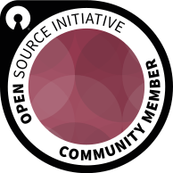

# I have migrated to a self-hosted forgejo instance! See <https://git.ari.lt/ari>.

    

Tl;dr of who I am can be found at <https://ari.lt/> and <https://git.ari.lt/ari>. I don't really use GitHub anymore, therefore, I won't be updating this repository no longer. The information you find here may differ from the real information.

-   `CURRENT_YEAR - 2007` years old
-   Self-taught open source developer 
-   Lithuanian
-   Languages
    -   Python
    -   C
    -   Shell scripting
    -   Can mess around in other languages as well, I'm not very language dependent
    -   Front-end web stuff
        -   CSS
        -   HTML
        -   JavaScript
-   Website: https://ari.lt/  |  views | [@ari-lt](https://ari.lt/lh)
-   OpenPGP/GPG: 4FAD63E936B305906A6C4894A50D5B4B599AF8A2
    -   Ari-web: <https://ari.lt/4FAD63E936B305906A6C4894A50D5B4B599AF8A2.asc>
    -   PGP: <https://keyserver2.pgp.com/vkd/DownloadKey.event?keyid=0xA50D5B4B599AF8A2>
    -   OpenPGP: <https://keys.openpgp.org/vks/v1/by-fingerprint/4FAD63E936B305906A6C4894A50D5B4B599AF8A2>
    -   Mailvelope: <https://keys.mailvelope.com/pks/lookup?op=get&search=ari@ari.lt>
    -   DNS: `dig d2efaa6dd6ae6136c19944fae329efd3fb2babe1e6eec26982a422aa._openpgpkey.ari.lt OPENPGPKEY`
-   Pronouns: she/her
-   Want to support? Note: You can either send to my wallet address immediately, or, you can use AnonPay if you want to use other coins which you can swap immediately. If you use AnonPay be quick since the transactions can take some time and expire.
    -   Monero (I tend to hold onto it): [451VZy8FPDXCVvKWkq5cby3V24ApLnjaTdwDgKG11uqbUJYjxQWZVKiiefi4HvFd7haeUtGFRBaxgKNTr3vR78pkMzgJaAZ](monero:451VZy8FPDXCVvKWkq5cby3V24ApLnjaTdwDgKG11uqbUJYjxQWZVKiiefi4HvFd7haeUtGFRBaxgKNTr3vR78pkMzgJaAZ?recipient_name=Ari%20Archer&tx_description=Donate%20to%20ari-web) (OpenAlias: `xmr@ari.lt`) | [AnonPay](https://ari.lt/xmr), [AnonPay onion](https://ari.lt/oxmr)
    -   Litecoin (I can use this immediately to pay for servers and whatnot :D): [ltc1qfmx6hvyfrphsp0uu29fjwzrqdpt8vse8p5xxh3](litecoin:ltc1qfmx6hvyfrphsp0uu29fjwzrqdpt8vse8p5xxh3?message=Donate%20to%20ari-web&time=1731763810) (OpenAlias: `ltc@ari.lt`) | [AnonPay](https://ari.lt/ltc), [AnonPay onion](https://ari.lt/oltc)
-   Contacts
    -   Email: <ari@ari.lt>
    -   Matrix: [@ari:ari.lt](https://matrix.to/#/@ari:ari.lt)
    -   Jabber/XMPP: [ari@ari.lt](xmpp:ari@ari.lt)
    -   Fediverse: [@ari@ak.ari.lt](https://ak.ari.lt/ari)

Meow.
